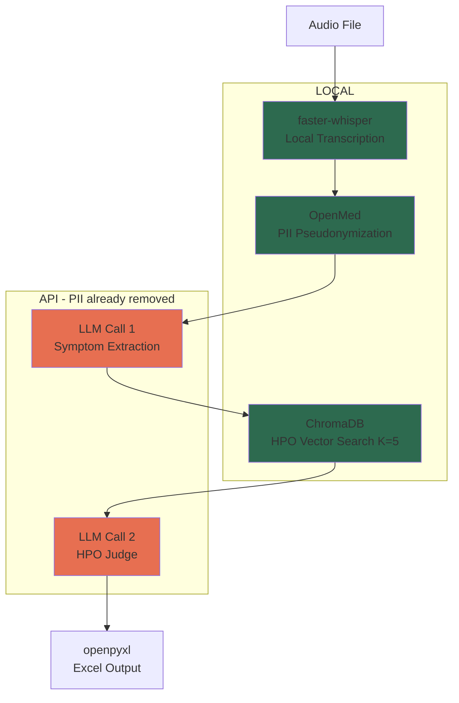

# HPO Identifier Pipeline for Long COVID Research

**Status**: Accepted

## Context

A GP conducting scientific research on long COVID currently processes patient interviews through a tedious manual pipeline: transcribe audio, manually scrub PII, paste into an LLM, manually format HPO codes. This takes significant time per interview, and he has ~150 existing recordings plus ongoing interviews to process.

**Forces at tension:**
- **GDPR + Belgian health data law** demands PII never leaves the local machine, but the best LLMs are cloud-based APIs
- **HPO accuracy** requires precise ontology codes (17K terms), but LLMs hallucinate codes when asked to generate them directly
- **French patient language** is colloquial and unpredictable, but HPO is an English-language ontology
- **Single user now**, but the tool may be shared with multiple clinicians later

**Ground truth exists**: 1003 manually coded rows in Excel provide validation data.

## Decision

Build a **Python CLI pipeline** with six sequential stages, each using the best-fit tool:

### Key architectural decisions:

1. **Hybrid HPO matching** (not pure LLM): LLM extracts symptoms as English clinical terms → ChromaDB vector search returns top-5 HPO candidates → second LLM call picks from bounded shortlist. Prevents hallucinated codes.

2. **Pseudonymization over anonymization**: PII entities replaced with consistent numbered tokens (`Dr. 1`, `Hospital 1`, `Date 1`) preserving clinical context and relational flow.

3. **Two separate LLM calls**: Separation of concerns — extraction and matching are independent cognitive tasks. Cost is negligible (~$3-15 for full batch of 150).

4. **Language bridge in the LLM**: First LLM call reads French transcript, outputs `clinical_term` in English (for HPO matching) and `patient_verbatim` in original French (for output).

5. **LLM-agnostic via thin config**: Provider and model specified in config file. No middleware dependency. Works with OpenAI, Anthropic, or local Ollama.

### Tech stack:

| Component | Tool | Rationale |
|-----------|------|-----------|
| Transcription | faster-whisper | 2-4x faster, pip install, French-tuned models (8% WER) |
| PII | OpenMed | 97.97% F1 French medical, 55+ entity types, local |
| Vector search | ChromaDB (embedded) | Zero-infra, 17K terms trivial |
| LLM | Direct API + config | Agnostic, simple, no middleware |
| State | SQLite | Single-file job tracker, queryable |
| Output | openpyxl | Matches GP's existing Excel format |

## Consequences

**Positive:**
- PII never reaches external APIs — GDPR compliant by architecture
- Hybrid HPO matching dramatically reduces code hallucination vs pure LLM
- Ground truth data (1003 rows) enables measurable validation with hierarchical scoring
- Sequential batch processing is simple to debug and maintain
- LLM-agnostic design allows switching providers without code changes

**Negative:**
- Two LLM calls per recording adds latency (~10-20s per recording)
- Pseudonymization depends on OpenMed's entity detection — missed PII could leak
- Phone-recorded audio may produce lower transcription quality
- ChromaDB embedding quality is a single point of failure for HPO matching

**Mitigations:**
- Latency acceptable for batch processing (not real-time)
- OpenMed at 97.97% F1 is best-in-class; manual review of first batch outputs as sanity check
- Test transcription on real audio samples first; add noise reduction only if needed
- Enriched HPO embeddings (name + synonyms + definition) maximize search quality; K=5 provides fallback breadth
